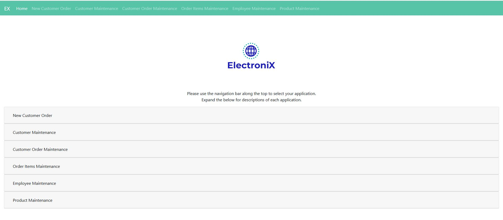
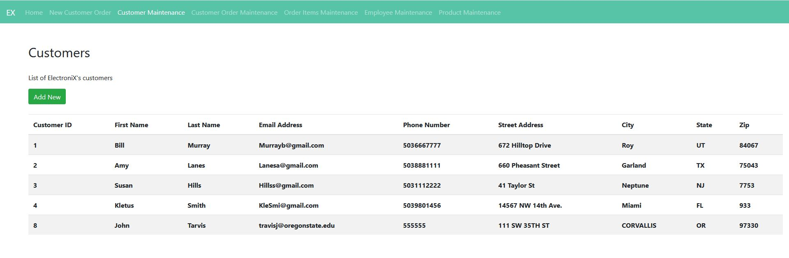
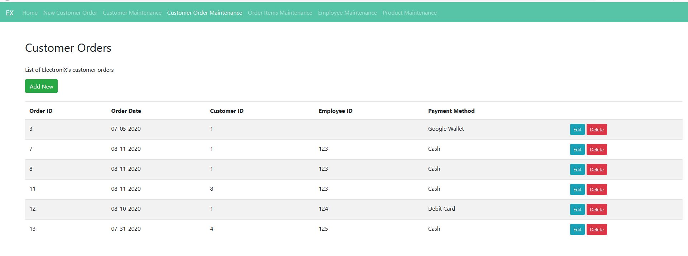
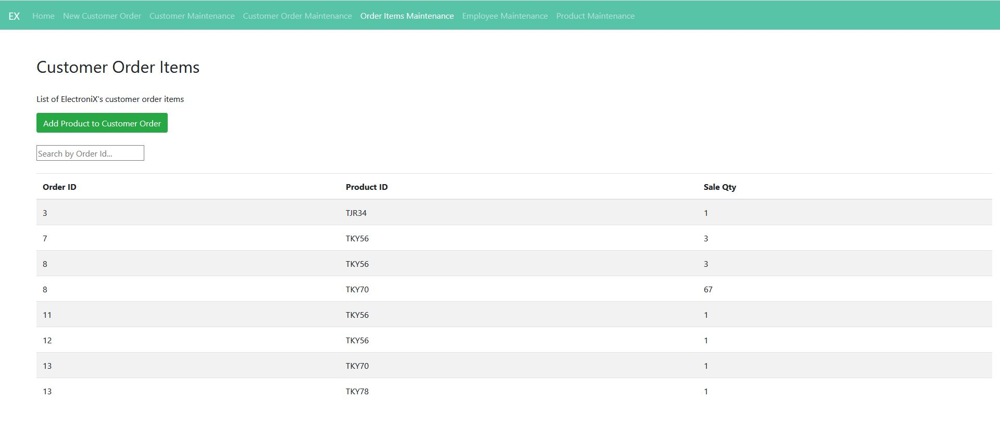
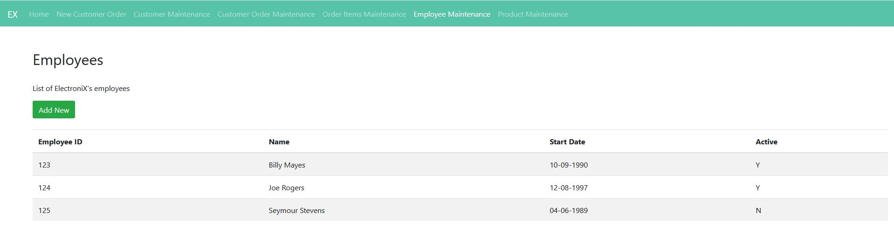
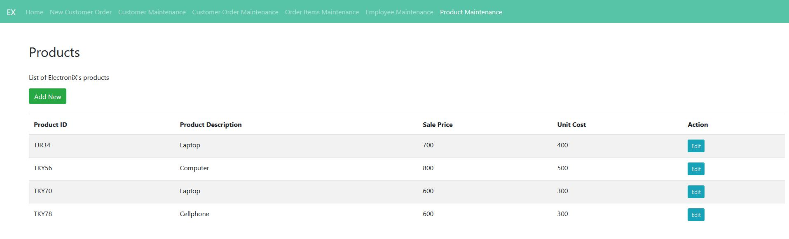

# CS340_ElectroniXWebsite
Website project for CS340 Intro to Databases

<!-- PROJECT LOGO -->
 

  

<!-- TABLE OF CONTENTS -->

  
Table of Contents

  <ol>
    <li>
      <a href="#about-the-project">About The Project</a>
      <ul>
        <li><a href="#built-with">Built With</a></li>
      </ul>
    </li>
    <li><a href="#usage">Usage</a></li>
    <li><a href="#contact">Contact</a></li>
  </ol>

<!-- ABOUT THE PROJECT -->
## About The Project

Final project for CS 340 Introduction to Databases developed by Juichi Lee and Darci Martin. ElectroniX is a fictional website we created to 
mimic real-world business store platforms for electronics such as Best Buy. The website features a simple front end and backend that is connected to 
a dedicated SQL database. Supports Create, Read, Update, and Delete operations. Entries listed in the tables on the website are real data stored in an online MariaDB database

(<a href="#readme-top">back to top</a>)

### Built With

Languages: HTML, CSS, Javascript, SQL
Framework-and-Tools: Express, Handlebars, Body-Parser, MySQL

(<a href="#readme-top">back to top</a>)

<!-- USAGE EXAMPLES -->
## Usage

(<a href="#readme-top">back to top</a>)

<!-- CONTACT -->
## Contact
This project is no longer supported by us. Let us know if you need help with setting up the project!

Juichi Lee - juichi.lee.0612@gmail.com
Darci Martin - darcimartin@sbcglobal.net

Project Link: [https://github.com/Juichilee/CS340_ElectroniXWebsite/new/master?readme=1](https://github.com/Juichilee/CS340_ElectroniXWebsite/new/master?readme=1)

(<a href="#readme-top">back to top</a>)

